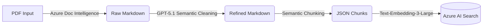

# MedTech Compliance Audit Engine (MVP)

**Status:** Phase 1 Completed (Knowledge Base Ingestion)
**Client:** Geister MedTech
**Tech Stack:** Azure Native (AI Search, OpenAI, Doc Intelligence)

## 🎯 Vision

This system automates regulatory monitoring and GAP analysis for MedTech manufacturers. It solves the problem of manually checking internal SOPs against constantly changing regulatory requirements (MDR, IVDR, MDCG).

Unlike simple "Chat with PDF" solutions, this system uses a Multi-Stage Refinement Pipeline to ensure critical regulatory nuances (footnotes, cross-references, table qualifiers) are not lost during technical chunking.

## 🏗 Data Pipeline Architecture

The process transforms unstructured PDFs (guidelines) into a high-precision, searchable vector database.



### The 4 Pipeline Phases

1.  **Ingestion (`ingest_manager.py`)**
    *   Uses Azure AI Document Intelligence (Layout Model).
    *   Extracts visual structure (tables, headers, paragraphs) instead of raw text.
    *   **Output:** `_raw.md` files.

2.  **Refinement (`refine_manager.py`)**
    *   **AI-Driven Cleaning:** An LLM (GPT-5.1/GPT-4o) reads the document.
    *   **Context Repair:** Footnotes at the bottom of the page are semantically moved to their reference in the text.
    *   **Noise Reduction:** Removes page numbers, headers, and artifacts.
    *   **Output:** `_cleaned.md` files (Human Readable).

3.  **Conversion (`mdcg_to_json.py`)**
    *   **Semantic Chunking:** Splitting based on Markdown headers (`#`, `##`), not arbitrary token limits.
    *   **Metadata Enrichment:** Adds hierarchy paths (Chapter > Section).
    *   **Output:** Granular JSON files per document.

4.  **Indexing (`upload_manager.py`)**
    *   Generates vectors using `text-embedding-3-large` (3072 dimensions).
    *   Uploads to Azure AI Search Index (`mdr-legal-index-v1`).

## 🚀 Installation & Setup

### 1. Environment Variables (`.env`)

Create a `.env` file in the root directory with the following keys:

```ini
# --- AZURE SEARCH (Vector DB) ---
AZURE_SEARCH_ENDPOINT="https://YOUR-SEARCH.search.windows.net"
AZURE_SEARCH_KEY="YOUR-ADMIN-KEY"
AZURE_SEARCH_INDEX="mdr-legal-index-v1"

# --- AZURE OPENAI: EMBEDDINGS ---
AZURE_OPENAI_EMBEDDING_ENDPOINT="https://YOUR-AI-RESOURCE-1.openai.azure.com/"
AZURE_OPENAI_EMBEDDING_KEY="KEY-1"
AZURE_OPENAI_EMBEDDING_DEPLOYMENT="text-embedding-3-large"
AZURE_OPENAI_EMBEDDING_API_VERSION="2024-02-01"

# --- AZURE OPENAI: CHAT / REFINER ---
AZURE_OPENAI_CHAT_ENDPOINT="https://YOUR-AI-RESOURCE-2.openai.azure.com/"
AZURE_OPENAI_CHAT_KEY="KEY-2"
AZURE_OPENAI_CHAT_DEPLOYMENT="gpt-5.1-chat"
AZURE_OPENAI_CHAT_API_VERSION="2024-12-01-preview"

# --- AZURE DOCUMENT INTELLIGENCE (OCR) ---
AZURE_DOCUMENT_INTELLIGENCE_ENDPOINT="https://YOUR-DOC-INTEL.cognitiveservices.azure.com/"
AZURE_DOCUMENT_INTELLIGENCE_KEY="YOUR-KEY"

# --- LOCAL PATHS (Configurable) ---
INPUT_PDF_PATH="data/input"           # PDF Dropzone
OUTPUT_MD_PATH="data/output"          # Raw MD Intermediate
OUTPUT_MD_PATH_REFINED="data/refined" # Clean MD Intermediate
OUTPUT_JSON_PATH="data/json"          # Ready for Upload
```

### 2. Install Dependencies

```bash
pip install -r requirements.txt
```

## 💻 Usage

To run the pipeline, use the `src_mdcg_pdf_handler/main.py` script. You can run the entire pipeline or specific steps.

### Run Complete Pipeline
```bash
python src_mdcg_pdf_handler/main.py --step all
```

### Run Specific Steps
You can run individual steps using the `--step` argument:

*   **Ingestion Only:**
    ```bash
    python src_mdcg_pdf_handler/main.py --step ingest
    ```
*   **Refinement Only:**
    ```bash
    python src_mdcg_pdf_handler/main.py --step refine
    ```
*   **Conversion Only:**
    ```bash
    python src_mdcg_pdf_handler/main.py --step convert
    ```
*   **Upload/Indexing Only:**
    ```bash
    python src_mdcg_pdf_handler/main.py --step upload
    ```

## 📂 Project Structure

```
.
├── src_mdcg_pdf_handler/
│   ├── main.py                 # Orchestrator Script (Entry Point)
│   ├── ingest_manager.py       # Phase 1: PDF to Markdown
│   ├── refine_manager.py       # Phase 2: Markdown Cleaning
│   ├── mdcg_to_json.py         # Phase 3: Markdown to JSON Chunks
│   └── upload_manager.py       # Phase 4: JSON to Azure Search
├── src/
│   ├── models.py               # Pydantic Data Models (MDRChunk)
│   └── mdr_parser.py           # Legacy: HTML Scraper for MDR
├── data/                       # Local Data Storage (Gitignored)
│   ├── input/                  # PDF Input
│   ├── refined/                # Quality Check Zone
│   └── json/                   # Upload Zone
├── tests/                      # Unit Tests
└── .env                        # Secrets
```

## ⚠️ Disclaimer

This tool is designed to assist Regulatory Affairs Managers. The results from the AI (especially during cleaning) must be validated. It does not replace a Notified Body.
